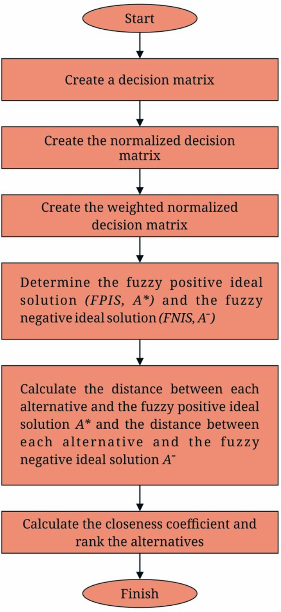
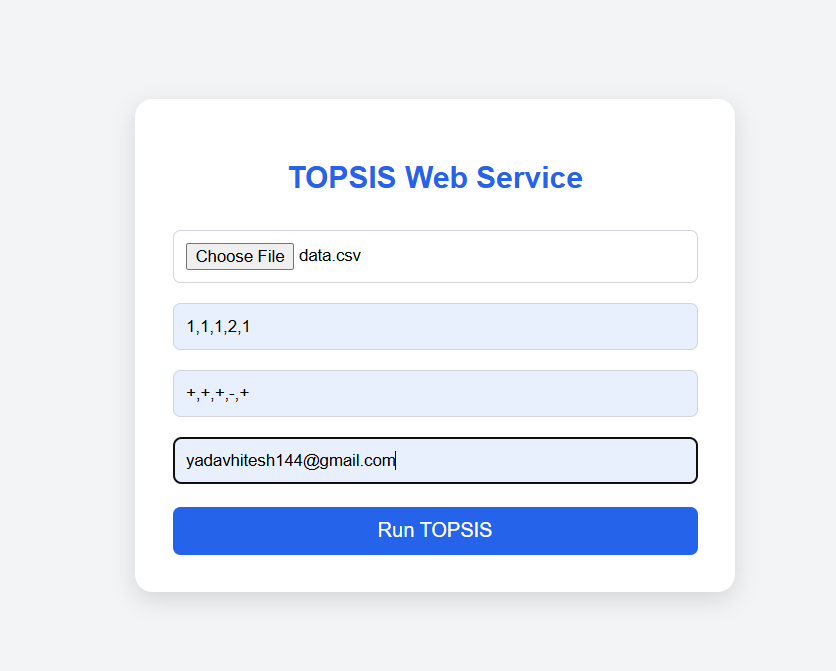
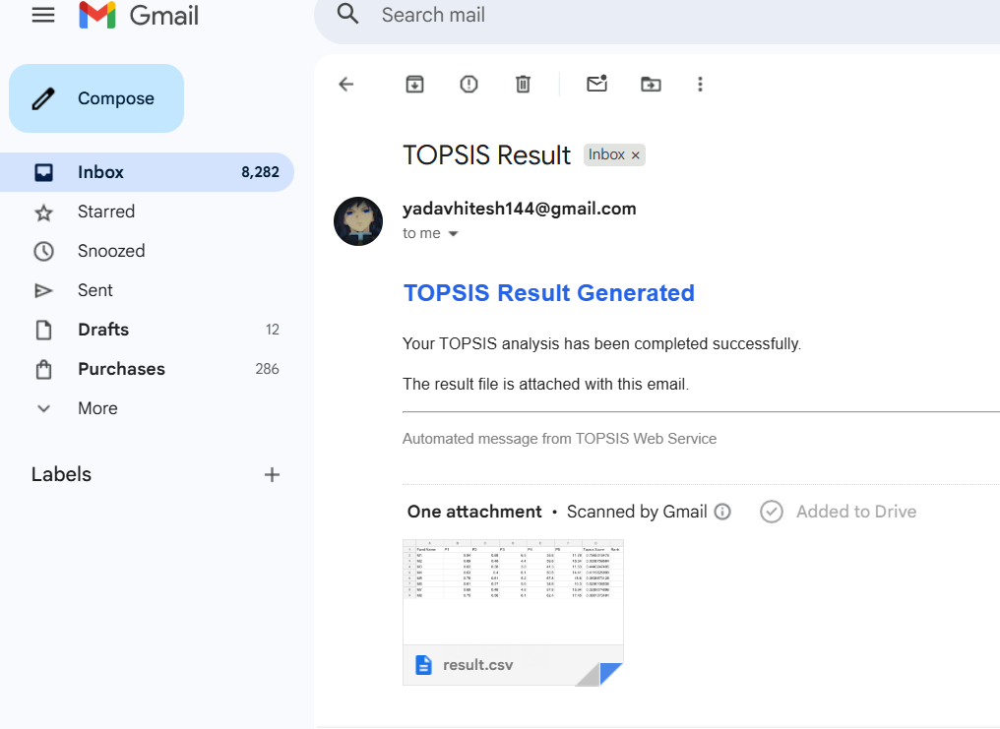

## Assignment-1: TOPSIS for Multiple-Criteria Decision Making 

## 📋 Overview

In a world full of choices, making the right decision isn't always easy— especially when multiple conflicting criteria are at play. Entering **TOPSIS** (Technique for Order Preference by Similarity to Ideal Solution) helps you find the best alternative by measuring proximity to the ideal solution.

The objective of this assignmnet is to implement the TOPSIS decision-making technique in Python and deliver the solution in three forms:
- A command-line based TOPSIS tool
- A distributable PyPI package with CLI support
- A web service capable of generating and emailing ranked result files

## TOPSIS Workflow

The following flowchart represents the step-by-step methodology of TOPSIS used in Multi-Criteria Decision Making (MCDM) problems:



## Part-I: Command Line Program

### Description
Part-I contains a Python script that implements the TOPSIS algorithm and executes via the command line. It reads a dataset file, applies the TOPSIS method using user-defined weights and impacts, and produces a ranked output CSV file.

### Command-Line Syntax
```bash
python <program.py> <InputDataFile> <Weights> <Impacts> <OutputResultFileName>
```

### Parameters
The program takes 4 input parameters (excluding the script name):

| Parameter   | Format                 | Example       | Description                     |
|------------|-------------------------|--------------|---------------------------------|
| Input file | Path string             | `"data.csv"` | Path to your CSV file           |
| Weights    | Comma-separated string  | `"1,1,1,1,2"`  | Weight for each criterion       |
| Impacts    | Comma-separated string  | `"+,+,-,+,+"`  | `+` for benefit, `-` for cost   |
| Output file| Path string             | `"result.csv"` | Where to save results         |


### Example Execution

Requirements: numpy, pandas, openpyxl

Grab an input csv or excel file strictly adheres to the following structure:
1. The file must have at least 3 columns- Candidate Identifier column followed by min. 2 criteria.
2. The first column must contain the names/IDs of the alternatives.
3. Criteria columns must contain only numeric values.

A sample dataset file (`data.csv`) is shown below:

| Fund Name | P1   | P2   | P3  | P4   | P5    |
| --------- | ---- | ---- | --- | ---- | ----- |
| M1        | 0.94 | 0.88 | 6.5 | 38.8 | 11.78 |
| M2        | 0.69 | 0.48 | 4.4 | 59.8 | 16.34 |
| M3        | 0.62 | 0.38 | 3.8 | 41.3 | 11.53 |
| M4        | 0.63 | 0.40 | 6.1 | 50.5 | 14.41 |
| M5        | 0.78 | 0.61 | 5.2 | 67.8 | 18.60 |
| M6        | 0.61 | 0.37 | 5.6 | 34.6 | 10.30 |
| M7        | 0.69 | 0.48 | 4.8 | 57.8 | 15.94 |
| M8        | 0.75 | 0.56 | 6.1 | 62.4 | 17.45 |

Run the following command through the terminal.
```bash
python topsis.py data.csv "1,1,1,1,2" "+,+,-,+,+" output_data1.csv
```

The output file (`result.csv`) generated will look like this:
| Fund Name | P1 | P2 | P3 | P4 | P5 | Topsis Score | Rank |
| --------- | ---- | ---- | --- | ---- | ----- | ------------ | ---- |
| M1 | 0.94 | 0.88 | 6.5 | 38.8 | 11.78 | 0.4740098823 | 5 |
| M2 | 0.69 | 0.48 | 4.4 | 59.8 | 16.34 | 0.5408838381 | 3 |
| M3 | 0.62 | 0.38 | 3.8 | 41.3 | 11.53 | 0.2680107006 | 7 |
| M4 | 0.63 | 0.4 | 6.1 | 50.5 | 14.41 | 0.3371798261 | 6 |
| M5 | 0.78 | 0.61 | 5.2 | 67.8 | 18.6 | 0.6988032678 | 1 |
| M6 | 0.61 | 0.37 | 5.6 | 34.6 | 10.3 | 0.0900806607 | 8 |
| M7 | 0.69 | 0.48 | 4.8 | 57.8 | 15.94 | 0.5089134079 | 4 |
| M8 | 0.75 | 0.56 | 6.1 | 62.4 | 17.45 | 0.5955525554 | 2 |

### Interpretation:
The TOPSIS scores represent how close each alternative is to the ideal best solution.

#### Sample input file is available in the `sample_data/` folder.
#### Sample output file is available in the `results/` folder.

---

## Part-II: PyPI Package

### Description
In Part-II, the TOPSIS implementation is packaged as a Python module and uploaded to PyPI, allowing installation via pip and execution using a CLI command.

### Package Information
- **Package Name:** Topsis-Vishard-102317240
- **Version:** 1.0.1
- **License:** MIT
- #### PyPI Link: https://pypi.org/project/Topsis-Vishard-102317240/1.0.1

### Package Installation

```bash
pip install Topsis-Vishard-102317240
```
### Usage

```bash
topsis <InputDataFile> <Weights> <Impacts> <ResultFileName>
```

---

## Part-III: Web Service (Flask)

### Description

Part-III includes a Flask-based web service for TOPSIS. The user uploads the dataset file, provides weights and impacts, and enters an email ID. The system computes the TOPSIS result file and sends it to the user via email.

### Features

- Upload dataset file (.csv / .xlsx)
- Enter weights and impacts
- Enter valid email ID
- Output file is generated and emailed to the user

### User Interface 


### Email Output


#### Live Link: https://assign1-topsis.onrender.com/
**Live Deployment Status:** While the application is compatible with platforms like Render or Railway, outbound SMTP (Email) traffic on ports 587 and 465 is currently blocked by these providers' free-tier firewalls to prevent spam. Consequently, the email-sending feature is best demonstrated in a local environment where network ports are unrestricted.

## Procedure to run locally
Follow these steps to set up and run the web service on your machine:

### 1. Prerequisites
Ensure you have Python installed and a Gmail account with an App Password generated (Required for SMTP authentication).

### 2. Clone and Setup
```bash
# Navigate to the web service directory
cd "web_service"

# Install dependencies
pip install -r requirements.txt
```

### 3. Environment Variables
Create a `.env` file in the web_service folder to store your credentials securely:

```Plaintext
GMAIL_APP_PASSWORD=your_16_char_app_password
```

### 4. Launch the Server
```bash
python app.py
```

The application will start at `http://127.0.0.1:5000`.

### 5. Usage
- Open the URL in your browser.
- Upload your criteria file.
- Enter Weights and Impacts.
- Provide your email address and click **Proceed & Email Results**.
- Check your email for the `result.csv` attachment.
